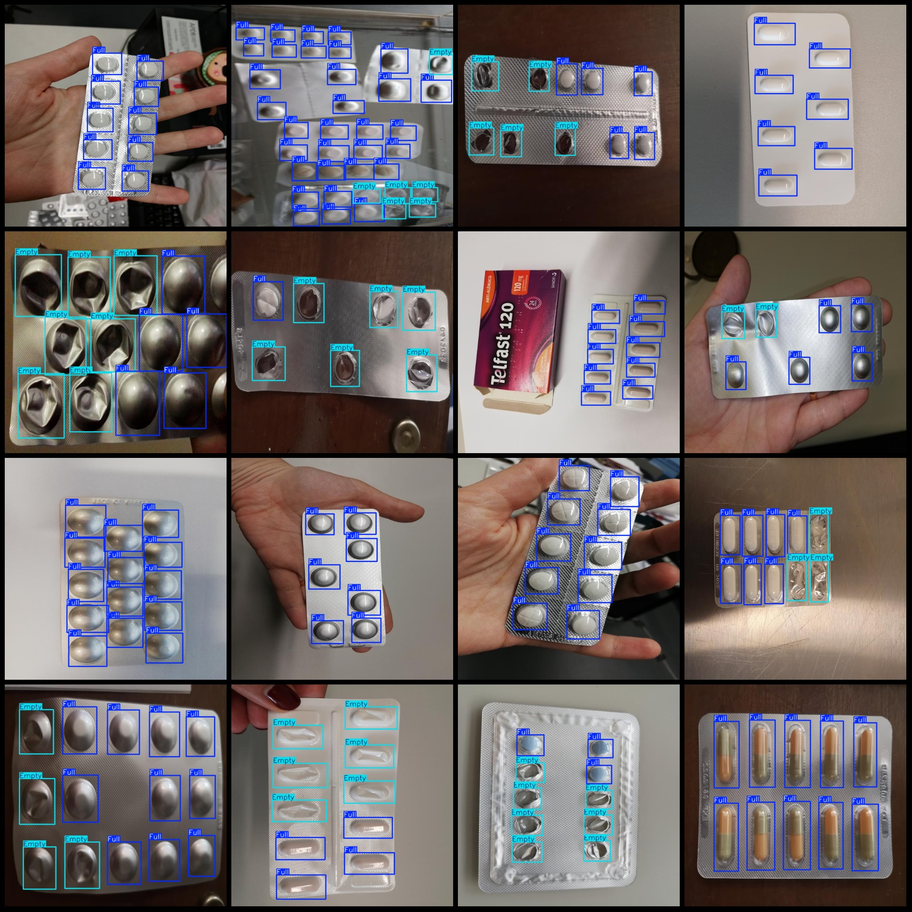
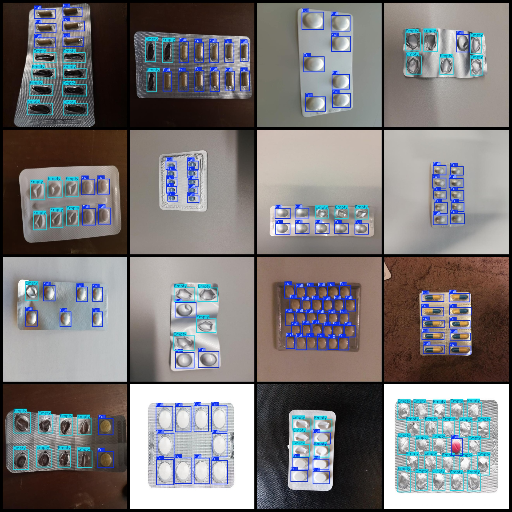

# Vocabulary and Context for Intelligent Medical Drugs (VOC+YOLO) Dataset with 935 Images in 2-class

The dataset format is Pascal VOC format+YOLO format. The text file does not contain any split paths, only contains the jpg image and corresponding VOC format xml file and yolo format txt file.
number of images: 935  
annotation count: 935  
annotation count: 935  
annotationnumber of classes: 2  
Annotation class names: ["Empty", "Full"]
boxes per class:   
Empty box count = 3547  
Full box count = 6333  
total boxes: 9880  
images per class:   
Empty occupies 657 images.
Full images = 865  
Image resolution: 640x640
Use the labeling tool: labelImg
Annotation Rules: Draw a rectangle around the class.
Important Notes: The dataset does not have a separate training, validation, or test set; you need to manually divide it.
Special Statement: This dataset does not guarantee any accuracy in the trained model or the weight file.
Image Preview:
## Images

Here is a pay link on Stripe ( https://buy.stripe.com/3cs8yP7sY87d0vu9AB ). Please contact me lonlonago@foxmail.com after funding $89, and I will send you a complete data files , thank you!

